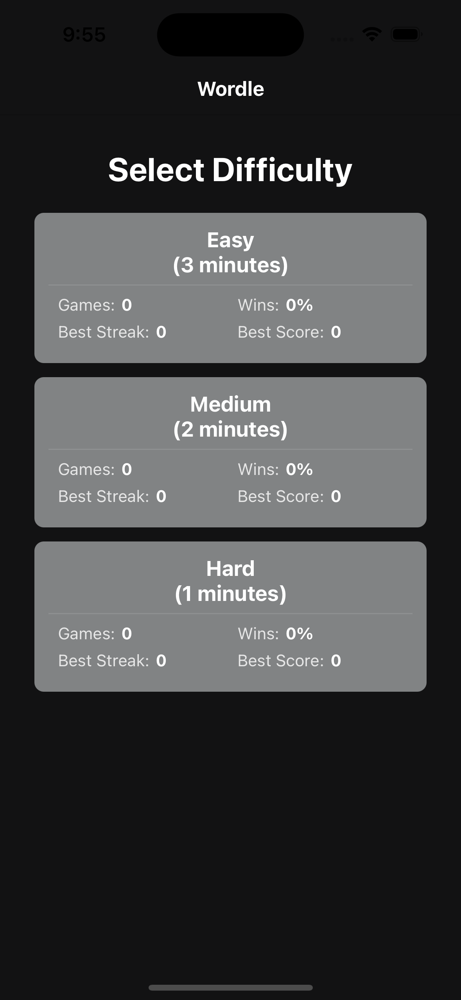
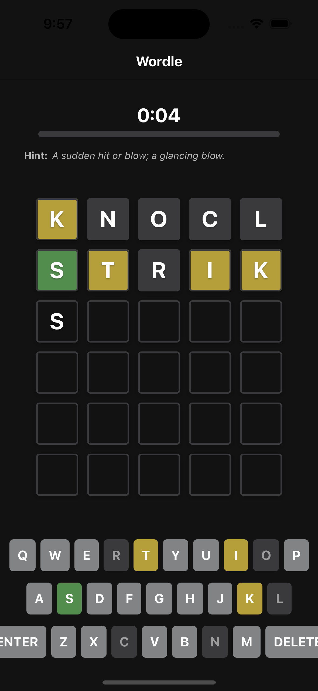
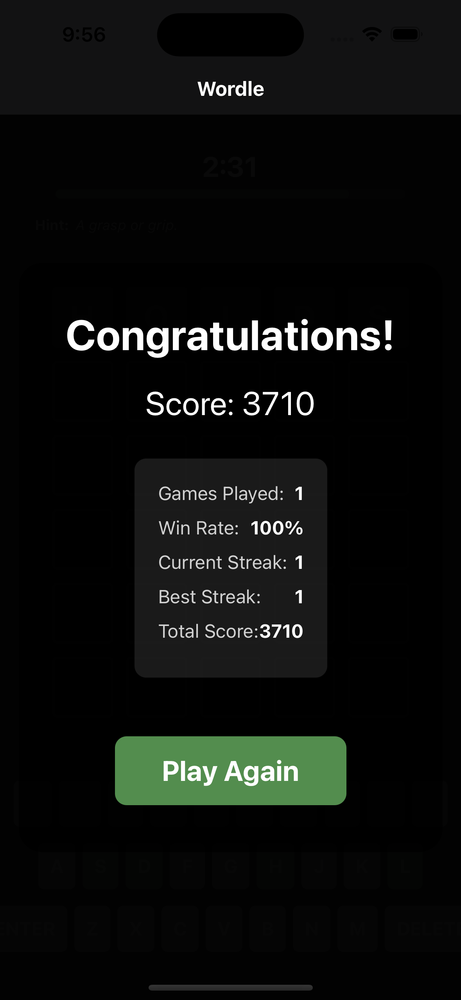

# Wordle Clone

A React Native mobile game inspired by the popular word-guessing game Wordle. Built with Expo and React Native, this app features multiple difficulty levels, a timer system, and persistent statistics tracking.

## Screenshots

<div align="center">
  <div style="display: flex; justify-content: space-between;">
    
    
    
  </div>
</div>

## Features

- 🎮 Three difficulty levels (Easy, Medium, Hard)
- ⏱️ Timer-based gameplay
- 💡 Helpful word hints
- 📊 Statistics tracking and persistence
- 🎨 Interactive keyboard with color feedback
- 🔄 Play again functionality
- 🌓 Dark/Light theme support
- 📱 Cross-platform support (Android & iOS for future builds, currently avail only for Android)

## Live Demo

Download the Android APK from our [latest release](https://github.com/zoecabrales/WordleClone/releases/latest).

## Getting Started

### Prerequisites

- Node.js (v18 or newer)
- npm or yarn
- Expo CLI
- Android Studio (for Android development)
- Xcode (for iOS development, Mac only)

### Installation

1. Clone the repository:
   ```bash
   git clone https://github.com/zoecabrales/WordleClone.git
   cd WordleClone
   ```

2. Install dependencies:
   ```bash
   npm install
   ```

3. Start the development server:
   ```bash
   npx expo start
   ```

4. Run on your preferred platform:
   - Press 'a' for Android
   - Press 'i' for iOS (requires Mac)
   - Scan QR code with Expo Go app on your device

## Game Rules

1. Guess the word within the time limit
2. Each guess must be a valid word
3. Colors indicate:
   - 🟩 Green: Letter is correct and in right position
   - 🟨 Yellow: Letter is in the word but wrong position
   - ⬜ Gray: Letter is not in the word
4. Theme-specific colors:
   - Light Theme:
     - Empty tile: Light gray
     - Correct letter: Green
     - Present letter: Yellow
     - Absent letter: Dark gray
     - Keyboard: Light gray
   - Dark Theme:
     - Empty tile: Dark gray
     - Correct letter: Green
     - Present letter: Yellow
     - Absent letter: Light gray
     - Keyboard: Dark gray

## Difficulty Levels

- **Easy**: 5 minutes, 5-letter words
- **Medium**: 3 minutes, 5-letter words
- **Hard**: 1 minute, 5-letter words

## Contributing

We welcome contributions! Here's how you can help:

1. Fork the repository
2. Create your feature branch:
   ```bash
   git checkout -b feature/AmazingFeature
   ```
3. Commit your changes:
   ```bash
   git commit -m 'Add some AmazingFeature'
   ```
4. Push to the branch:
   ```bash
   git push origin feature/AmazingFeature
   ```
5. Open a Pull Request

## Tech Stack

- React Native
- Expo
- TypeScript
- AsyncStorage for data persistence
- React Navigation
- Expo Router
- Zustand for state management
- React Native Reanimated for animations

## Performance Optimizations

Recent improvements to the codebase include:

- Memoization of key components and callbacks using `useMemo` and `useCallback`
- Optimized state updates in the game store
- Improved component re-rendering patterns
- Default exports for better module organization
- Optimized animations and transitions

## Project Structure

```
wordleClone/
├── app/                    # Main application code
│   ├── components/         # Reusable components
│   │   ├── GameBoard.tsx   # Game board component
│   │   ├── GameStatus.tsx  # Game status display
│   │   ├── Hint.tsx        # Word hint component
│   │   ├── Keyboard.tsx    # Virtual keyboard
│   │   ├── SplashScreen.tsx # App splash screen
│   │   ├── ThemeToggle.tsx # Theme switcher
│   │   ├── Tile.tsx        # Individual game tile
│   │   └── Timer.tsx       # Game timer
│   ├── constants/         # Constants and configurations
│   │   ├── colors.ts      # Color definitions
│   │   ├── gameSettings.ts # Game settings
│   │   └── words.ts       # Word list
│   ├── store/            # State management
│   │   ├── gameStore.ts  # Game state
│   │   └── themeStore.ts # Theme state
│   └── services/         # API and other services
├── assets/               # Images and other static assets
└── types/               # TypeScript type definitions
```

## Acknowledgments

- Inspired by the original [Wordle](https://www.nytimes.com/games/wordle/index.html) game
- Built with [Expo](https://expo.dev/)
- Word definitions from [Free Dictionary API](https://dictionaryapi.dev/)

## Contact

Jireh Zoe Cabrales - [@zoecabrales](https://github.com/zoecabrales)

Project Link: [https://github.com/zoecabrales/WordleClone](https://github.com/zoecabrales/WordleClone)
